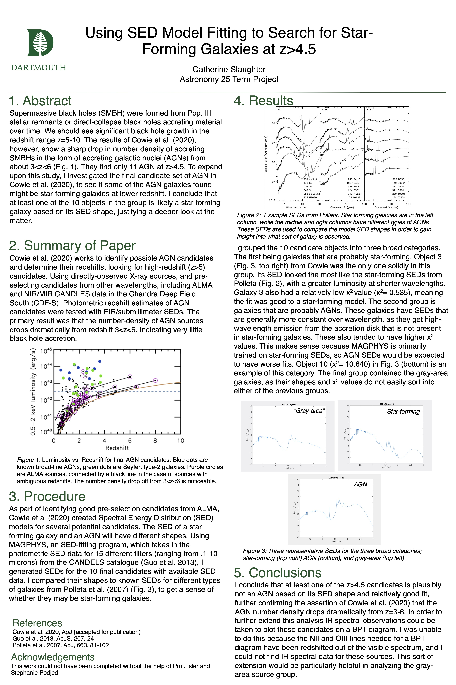
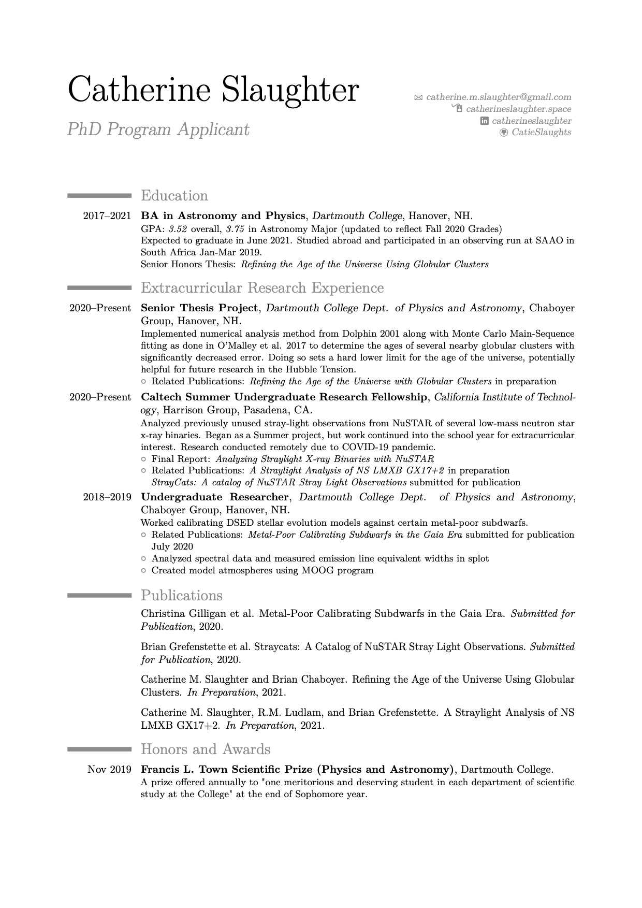
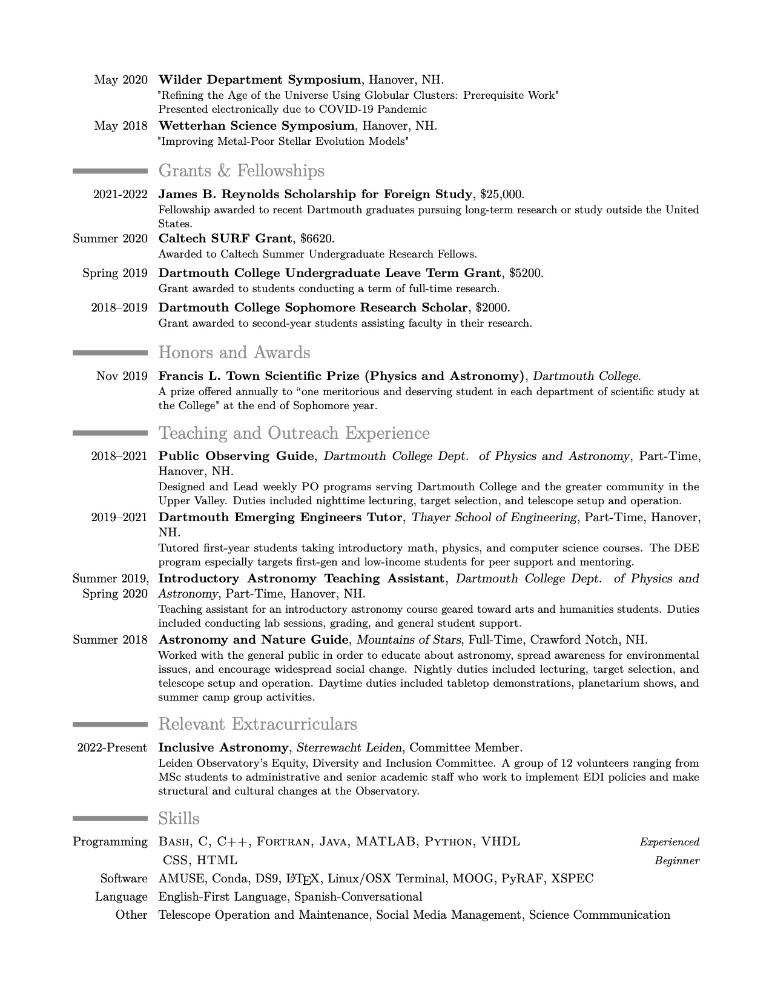

Oh, hi, you found this hidden text, this was written to debug my HTML and Markdown...

## Introduction
Hi! I'm Catherine and I am a fourth-year undergraduate studying Physics and Astronomy at Dartmouth College in Hanover, NH. After graduating in June 2021, I plan to pursue a PhD in astronomy and astrophysics (please let me into your grad program). I am passionate about STEM education and outreach, and want to continue working with the general public along with conducting my research. I am dedicated to affirmative inclusivity in the sciences--not just "diversity"--working both toward personal growth and institutional change. I have served as a mentor for underprivileged students, and helped found a BIPOC big sibling program at my small, all-women's high school. This program aims to help students of color combat imposter syndrome, and to encourage them to pursue any field of interest! Outside of school and research, I am a **huge** Chicago Cubs baseball fan, ukulele player, and avid hiker. 

Although I've been told many times to not open with this, I have wanted to be an astronomer since the 4th grade, and as I've spent my undergrad working on research, my love of the subject has only grown. From spending my first year doing grunt work to presently working on two separate first-author publications. My research work is some of the most fulfilling work I've ever done, and I look forward to pursuing it further. Ultimately, my end goal is to work as a professor, teaching students, doing public education, and conducting research. Examples of past work and a copy of my current CV can be found below.

## Research Interests

I am generally interested in observational and computational astrophysics. Along with having taken many classes with research-based components and having gone observing on several observing runs, I have taken Computer Science coursework well beyond what is required for my undergraduate degree, and consistently apply those skills to my research.

Topics of current research include:

* Stellar Evolution Modeling
    * Pop II stars
    * Milky-way Globular cluster systems
        * Main-sequence fitting and assorted numerical analyses
    * Search for Pop III stars and stellar remnants
    
* High-energy Stellar Systems
    * X-ray Binary systems
        * Modelling reflection features in Xspec
        * NuSTAR observations
        * Analysis of serendipidous straylight observations

## Publications

Christina Gilligan, Brian Chaboyer, and Catherine M. Slaughter. Metal-Poor Calibrating Subdwarfs in the Gaia Era. *Submitted for Publication*, 2020.

Brian Grefenstette et al. StrayCats: A catalog of NuSTAR Stray Light Observations. *Submitted for Publication*, 2020.

Catherine M. Slaughter and Brian Chaboyer. Refining the Age of the Universe Using Globular Clusters. *In Preparation*, 2021.

Catherine M. Slaughter, R.M. Ludlam, and Brian Grefenstette. A Straylight Analysis of NS LMXB GX17+2. *In Preparation*, 2021.

## Research Projects

Some examples of significant written reports and poster presentations, both from coursework and paid research work.

* Analyzing Straylight X-Ray Binaries with NuSTAR [(Paper)](https://github.com/catieslaughts/catieslaughts.github.io/raw/master/images_pdfs/Slaughter_FinalReport.pdf)[(Poster)](https://github.com/catieslaughts/catieslaughts.github.io/raw/master/images_pdfs/SURFfinalPoster.pdf)
   * SURF project completed Summer 2020. Poster presented at virtual seminar for Caltech SFP students. 
   
   
* Refining the Age of the Universe Using Globular Clusters: Prerequisite Work [(Poster)](https://github.com/catieslaughts/catieslaughts.github.io/raw/master/images_pdfs/thesisPrelim.pdf)
   * Preliminary work for Senior Thesis project. Poster presented virtually at Physics and Astronomy Department Symposium May 2020
   
   
* Using SED Model Fitting to Search for Star-Forming Galaxies at z>4.5 [(Paper)](https://github.com/catieslaughts/catieslaughts.github.io/raw/master/images_pdfs/A25FinalProj.pdf) [(Poster)](https://github.com/catieslaughts/catieslaughts.github.io/raw/master/images_pdfs/Slaughter_catherine_finalPoster.pdf)
   * Final project for an intermediate-level Astronomy class ("Galaxies and Cosmology")
   
   
* Computer Modeling and Simulation Project [(Report)](https://github.com/catieslaughts/catieslaughts.github.io/raw/master/images_pdfs/P50ModelingProj.pdf)
   * Coding project for an intermediate-level Quantum Mechanics class. Code written in MATLAB
* Polyphonic Digital Synthesizer [(Report)](https://github.com/catieslaughts/catieslaughts.github.io/raw/master/images_pdfs/ENGS31FinalReport.pdf) [(Git Repo)](https://github.com/catieslaughts/PolyphonicSynthesizer)
   * Final project for a Digital Electronics class. Code written primarily in VHDL.
* A Deeper Analysis of Cataclysmic Variable V383 Vel [(Paper)](https://github.com/catieslaughts/catieslaughts.github.io/raw/master/images_pdfs/A81FinalProj.pdf)
   * Final Paper for a Special Topics class in Astronomy. Completed as part of a study abroad to South Africa in Winter 2019. Project included a week-long observing run at SAAO
* Improving Metal-Poor Stellar Evolution Models [(Poster)](https://github.com/catieslaughts/catieslaughts.github.io/raw/master/images_pdfs/StellarEvolutionWISPPoster.pdf)
   * Presented at Wetterhan Science Symposium May 2018. Research was done as an intern of the Women In Science Project (WISP) at Dartmouth College
   
   

## CV

The MOST recent version of my CV can always be found on <a href="https://www.overleaf.com/read/rgjgxdyfkwcc" target="_blank" >Overleaf</a>

[Download as PDF](https://github.com/catieslaughts/catieslaughts.github.io/raw/master/images_pdfs/WebsiteCV.pdf) (Updated 10/27/2020)

<!---->

<!--For more details see [GitHub Flavored Markdown](https://guides.github.com/features/mastering-markdown/).-->
