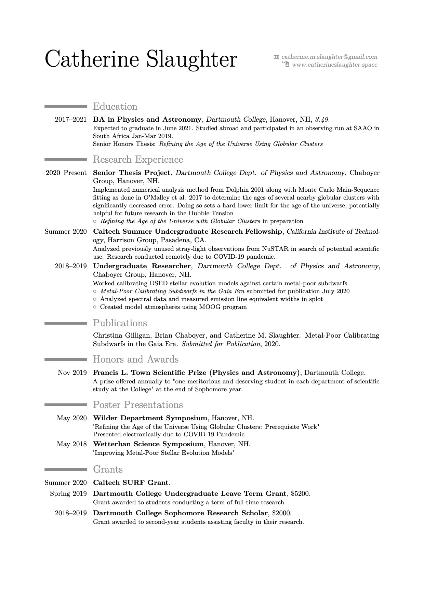

I am an undergraduate in the class of 2021 studying Physics and Astronomy Dartmouth College in Hanover, NH. After graduating, I plan to continue my education in an Astrophysics PhD program. I am passionate about STEM education and outreach, and want to continue working with the general public along with conducting my research. Outside of school and research, I am a **huge** Chicago Cubs baseball fan, ukulele player, and avid hiker.

## Research Interests

Topics of current research include:

* Stellar Evolution Modeling
    * Pop II stars
    * Milky-way Globular cluster systems
        * Main-sequence fitting and assorted numerical analysis
    * Search for Pop III stars and stellar remnants
    
* High-energy Stellar Remnants
    * X-ray Binary systems
    
In general, I am also interested in the applications of coding to all Astrophysics research. I have taken Computer Science coursework well beyond what is required for my undergraduate degree, and consistently apply those skills to my research.

## Publications

Christina Gilligan, Brian Chaboyer, and Catherine M. Slaughter. Metal-Poor Calibrating Subdwarfs in the Gaia Era. *Submitted for Publication*, 2020.

## Research Papers and Posters

Some examples of significant written reports and poster presentations, both from coursework and paid research work.
* Papers:
* Posters:
   * Refining the Age of the Universe Using Globular Clusters: Prerequisite Work [(PDF)](https://github.com/catieslaughts/catieslaughts.github.io/raw/master/images_pdfs/thesisPrelim.pdf)
   

## CV

[Download as PDF](https://github.com/catieslaughts/catieslaughts.github.io/raw/master/images_pdfs/websitecv.pdf)

<!---->

<!--For more details see [GitHub Flavored Markdown](https://guides.github.com/features/mastering-markdown/).-->
