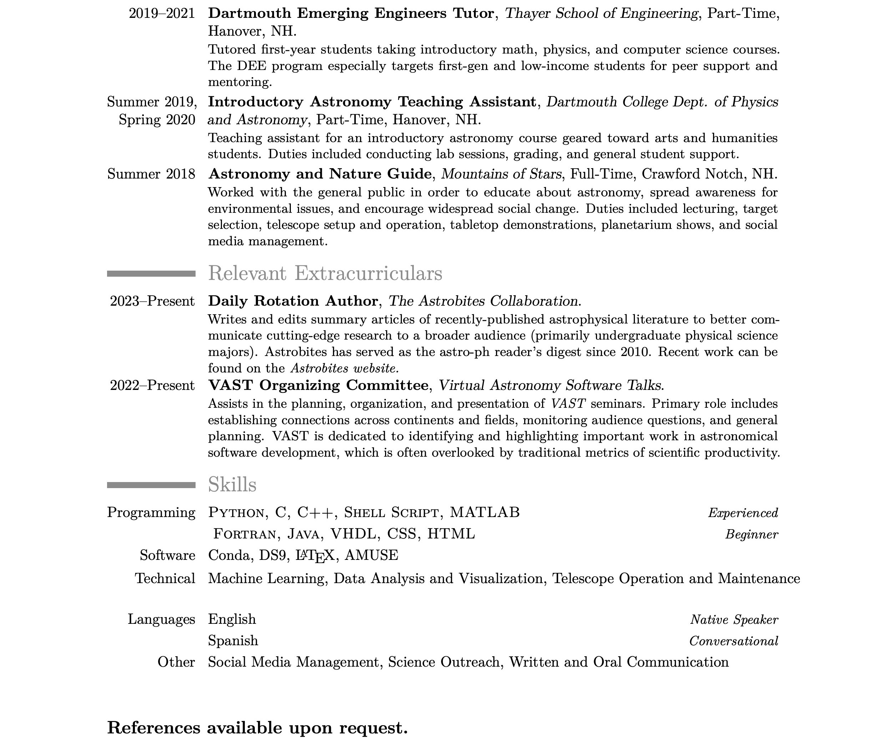

<link rel="stylesheet" href="https://cdnjs.cloudflare.com/ajax/libs/font-awesome/4.7.0/css/font-awesome.min.css">

  (Updated 17 July, 2024)

<!--
-->
# Curriculum Vitae

  

    test
  

  

    test2
  

  
  <a href="https://github.com/catieslaughts/catieslaughts.github.io/raw/master/images_pdfs/CV/WebsiteCV.pdf">Download as PDF</a>
   
   
   

The most recent version of my CV can always be found on <a href="https://www.overleaf.com/read/rgjgxdyfkwcc" target="_blank" >Overleaf</a>

## LinkedIn
Similar information can be found on my <a href="https://www.linkedin.com/in/catherineslaughter" target="_blank"> LinkedIn</a>
