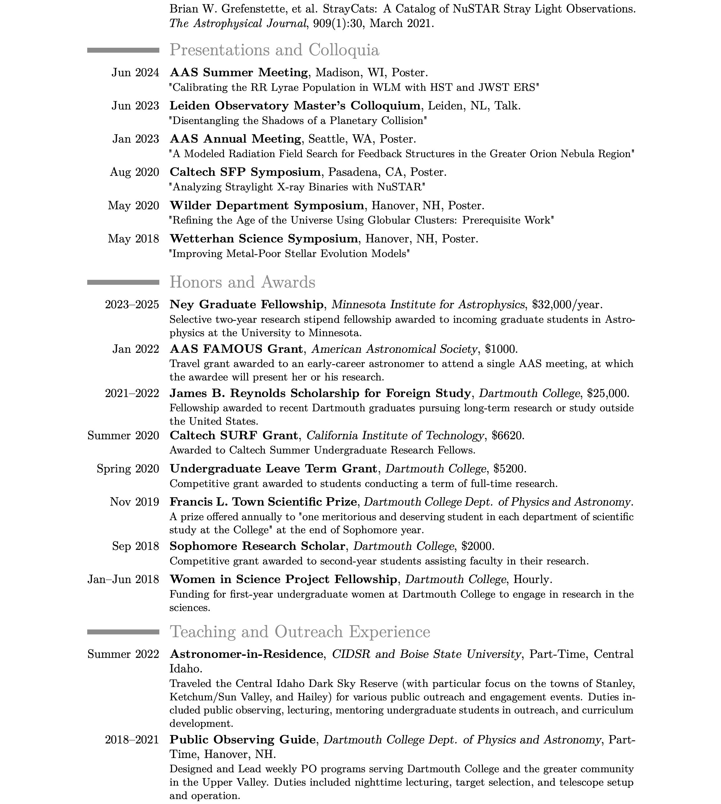

# Curriculum Vitae

  (Updated 17 July, 2024)

 

  <a href="https://github.com/catieslaughts/catieslaughts.github.io/raw/master/images_pdfs/CV/WebsiteCV.pdf">test</a>

   
   
   

<i class="fa-solid fa-download"></i>

The most recent version of my CV can always be found on <a href="https://www.overleaf.com/read/rgjgxdyfkwcc" target="_blank" >Overleaf</a>

## LinkedIn
Similar information can be found on my <a href="https://www.linkedin.com/in/catherineslaughter" target="_blank"> LinkedIn</a>
