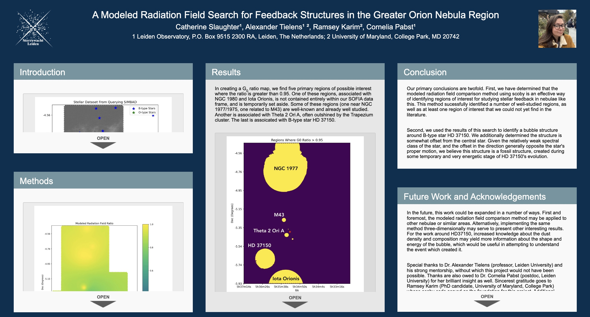
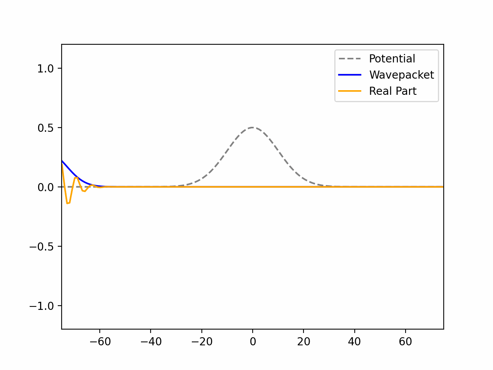
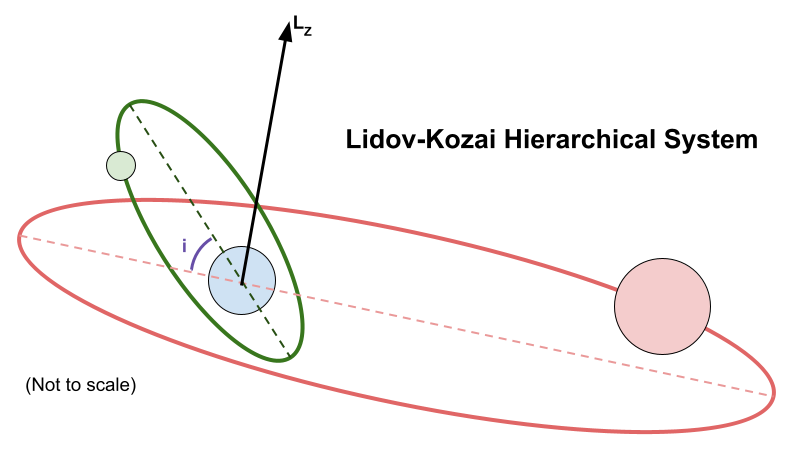
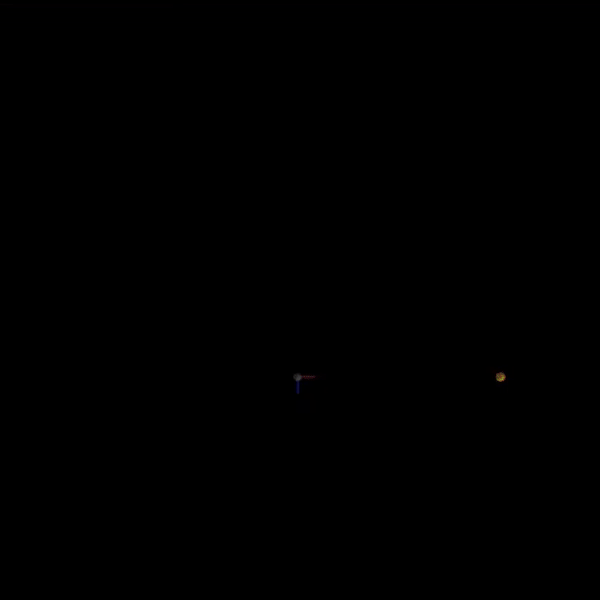
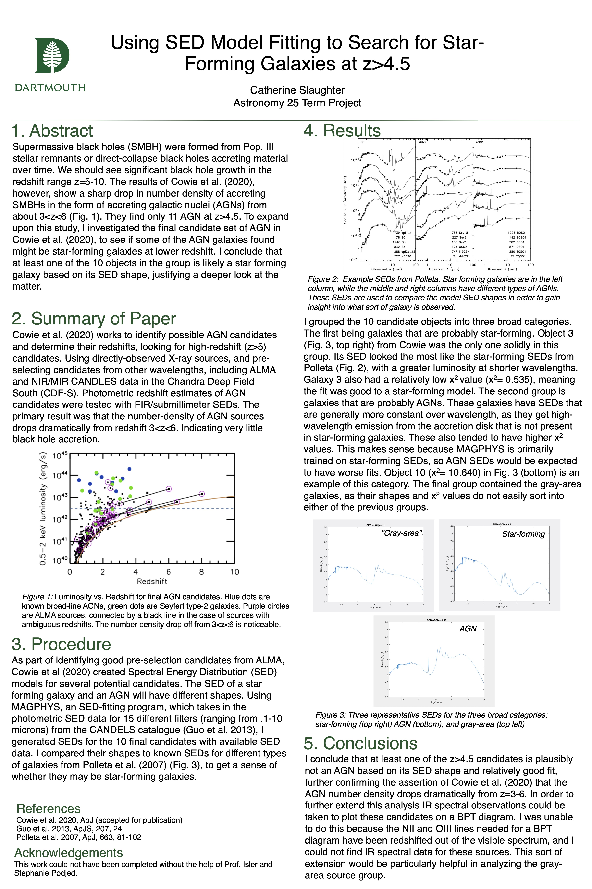

# Significant Projects
Some examples of significant written reports and poster presentations, both from coursework and paid research work.
 (Do you want to <a href='http://www.catherineslaughter.space/games/'>play a game</a>?)
### 2023
- **_Disentangling the Shadows of a Planetary Collision_** [[Thesis]](https://github.com/catieslaughts/catieslaughts.github.io/raw/master/images_pdfs/proj_reports/Slaughter_MasterThesis.pdf)
    - M.Sc. thesis
    - Simulated planetesimal collision remnants in Python
    - Created model light curves for simulated remnant transit around distant stars
    - Fit model light curves to real data
     
  

- _Ultra-Hot Rocky Planets (Lava Worlds)_ (Spring 2023)[[Report]](https://github.com/catieslaughts/catieslaughts.github.io/raw/master/images_pdfs/proj_reports/Lava_Worlds_Essay.pdf)
    - Final group paper for Exoplanets: Interiors and Atmospheres
    - Analyzes current literature about so-called "Lava World"-type planets, as well as discussing future pathways for further reserach and observation
  

- _Modelling Sub-Neptunes with MESA_ (Spring 2023) [[Report]](https://github.com/catieslaughts/catieslaughts.github.io/raw/master/images_pdfs/proj_reports/EIA_MESAlab.pdf)
    - Project for Exoplanets: Interiors and Atmospheres
    - Makes use of the Modules for Experiments in Stellar Astrophysics (MESA) 1-D evolution code

### 2022
- _SDSS Object Classification with Random Forest_ (Fall 2022) [[Report]](https://github.com/catieslaughts/catieslaughts.github.io/raw/master/images_pdfs/proj_reports/IML_Assignment2.pdf) <a href="https://github.com/catieslaughts/IML_assignment2" target="_blank" >[Github]</a>
    - Project for Introduction to Machine Learning
    - Classification of a number of SDSS objects as stars, QSOs, and galaxies
    - Written in Python using Jupyter
    - Machine learning methods used include:
        - Dimensionality Reduction:
            - Principle Component Analysis (PCA)
            - Uniform Manifold Approximation and Projection (UMAP)
            - T-Distributed Stochastic Neighbor Embedding (TSNE)
        - Clustering:
            - K-means
            - Density-based Spatial Clustering of Applications with Noise (DBSCAN)
         - Binary Tree Learners
         - Simple Cross-Validation
         - Random Forest Ensemble Learning
         - Grid Search Cross-Validation for Metaparameter Tuning
         
  

- _AdaBoost Ensemble Learning with a Linear Halfspaces Perceptron Algorithm_ (Fall 2022) [[Report]](https://github.com/catieslaughts/catieslaughts.github.io/raw/master/images_pdfs/proj_reports/IML_Assignment1.pdf) <a href="https://github.com/catieslaughts/IML_assignment1" target="_blank" >[Github]</a>
    - Project for Introduction to Machine Learning
    - Written in Python
    - Machine learning methods used include:
        - Linear Halfspaces weak learners
        - Perceptron Algorithms
        - Ensemble Learning via AdaBoost algorithm
  

- _**Nebular Chewing Gum: A Modeled Radiation Field Search for Bubble Structures in the Greater Orion Nebula Region**_ (School Year 2021-2022) [[Report]](https://github.com/catieslaughts/catieslaughts.github.io/raw/master/images_pdfs/proj_reports/Slaughter_FirstYearProject_final.pdf) <a href="https://aas241-aas.ipostersessions.com/Default.aspx?s=41-6C-57-15-82-B4-37-FF-FD-3B-41-29-E1-FD-C6-82" target="_blank" >[iPoster]</a>
    - First-year MSc research project
    - Used modeled radiation field code to identify regions of the Greater Orion Nebula where radiative input is not dominated by the Trapezium
    - Studied equivalent regions in Herschel 70/160 micron and SOFIA CII data
    - Identified a new fossil bubble structure around star HD 37150
    - Presented as an iPoster at AAS 241
     
  

- _The Evolution of a 1.5M⊙ Star_ (Spring 2022) [[Report]](https://github.com/catieslaughts/catieslaughts.github.io/raw/master/images_pdfs/proj_reports/Stellar_Structure_and_Evolution_Assignment.pdf)
    - Project for Stellar Structure and Evolution
    - Makes use of the Modules for Experiments in Stellar Astrophysics (MESA) 1-D evolution code
   

- _Quantum Wavepacket Tunneling Simulation_ (Spring 2022) <a href="https://github.com/catieslaughts/quantum_wavepacket_sim" target="_blank" >[Github]</a>
    - Project for Computational Physics
    - Written in Python
     
  

- _Ising Model MCMC Simulation_ (Spring 2022) [[Report]](https://github.com/catieslaughts/catieslaughts.github.io/raw/master/images_pdfs/proj_reports/COP_project_report2.pdf) <a href="https://github.com/catieslaughts/ising_model_sim" target="_blank" >[Github]</a>
    - Project for Computational Physics
    - Written in Python
   

- _Argon Molecular Dynamics Simulation_ (Spring 2022) [[Report]](https://github.com/catieslaughts/catieslaughts.github.io/raw/master/images_pdfs/proj_reports/Comp_Phys_A1.pdf) <a href="https://gitlab.com/lukas_welzel/computational-physics/-/tree/main/assignment_1" target="_blank" >[Gitlab]</a>
    - Project for Computational Physics
    - Written in Python
    - Uses object-oriented methods

### 2021
- _Modelling Lidov-Kozai Oscillations and Tidal Friction in a System of Exomoons_ (Fall 2021) [[Report]](https://github.com/catieslaughts/catieslaughts.github.io/raw/master/images_pdfs/proj_reports/AMUSE_FinalProj.pdf) <a href="https://github.com/peterbreslin/amuse-project" target="_blank" >[Github]</a>
    - Term project for Simulation and Modelling in Astrophysics in AMUSE
    - Written in Python utilizing the Astrophysical Multipurpose Software Environment
 
  

- _Hubble's Law and the Hubble Tension: A Brief Overview_ (Spring 2021) [[Paper]](https://github.com/catieslaughts/catieslaughts.github.io/raw/master/images_pdfs/proj_reports/HubbleLawOverview.pdf)
    - Final paper for intro-level History and Philosophy of Science class
    - Base-level description of the Hubble Tension
  

- _Determining the age of ε Chamaeleontis with MIST Isochrones_ (Winter 2021) [[Report]](https://github.com/catieslaughts/catieslaughts.github.io/raw/master/images_pdfs/proj_reports/A117.pdf) [[Analysis Toolkit]](https://github.com/catieslaughts/catieslaughts.github.io/raw/master/images_pdfs/A117_analysistoolkit.zip) 
    - Final Project for graduate-level Observational Galactic Astrophysics
    - Written in Python using Jupyter
  

- _Observational Basis for Standard Big Bang Nucleosynthesis and Modeling in PRIMAT_ (Winter 2021) [[Report]](https://github.com/catieslaughts/catieslaughts.github.io/raw/master/images_pdfs/proj_reports/Slaughter_P92_Final.pdf) 
    - Final paper for graduate-level Cosmology

### 2020
- _Modeling Tidal Disruption Events in a Classical Regime_ (Fall 2020) [[Report]](https://github.com/catieslaughts/catieslaughts.github.io/raw/master/images_pdfs/proj_reports/tidaldisruption_Report.pdf) <a href="https://youtu.be/Jdm8zmiU0OY" target="_blank" >[Video] </a> <a href="https://github.com/catieslaughts/tidal-disruption-sim" target="_blank" >[Github]</a>
     - Final project for an upper-level Physical Modeling class (COSC 89.18)
     - Written in C++
    
  

- _Analyzing Straylight X-Ray Binaries with NuSTAR_ (Summer 2020) [[Report]](https://github.com/catieslaughts/catieslaughts.github.io/raw/master/images_pdfs/proj_reports/SURF_FinalReport.pdf)[[Poster]](https://github.com/catieslaughts/catieslaughts.github.io/raw/master/images_pdfs/proj_posters/SURFfinalPoster.pdf)
     - SURF project completed Summer 2020. Poster presented at virtual seminar for Caltech SFP students
    
  

- _Refining the Age of the Universe Using Globular Clusters: Prerequisite Work_ (Spring 2020) [[Poster]](https://github.com/catieslaughts/catieslaughts.github.io/raw/master/images_pdfs/proj_posters/thesisPrelim.pdf)
     - Preliminary work for culminating research project
     - Poster presented virtually at Physics and Astronomy Department Symposium May 2020
    
  

- _Using SED Model Fitting to Search for Star-Forming Galaxies at z>4.5_ (Winter 2020) [[Report]](https://github.com/catieslaughts/catieslaughts.github.io/raw/master/images_pdfs/proj_reports/A25FinalProj.pdf) [[Poster]](https://github.com/catieslaughts/catieslaughts.github.io/raw/master/images_pdfs/proj_posters/A25_finalPoster.pdf)
     - Final project for an intermediate-level Astronomy class ("Galaxies and Cosmology")
    

### 2019   
- _Computer Modeling and Simulation Project_ (Fall 2019) [[Report]](https://github.com/catieslaughts/catieslaughts.github.io/raw/master/images_pdfs/proj_reports/P50ModelingProj.pdf)
     - Coding project for an intermediate-level Quantum Mechanics class
     - Code written in MATLAB
  

- _Polyphonic Digital Synthesizer_ (Summer 2019) [[Report]](https://github.com/catieslaughts/catieslaughts.github.io/raw/master/images_pdfs/proj_reports/ENGS31FinalReport.pdf) <a href="https://github.com/catieslaughts/PolyphonicSynthesizer" target="_blank" >[Github]</a>
     - Final project for a Digital Electronics class
     - Code written primarily in VHDL
  

- _A Deeper Analysis of Cataclysmic Variable V383 Vel_ (Winter 2019) [[Report]](https://github.com/catieslaughts/catieslaughts.github.io/raw/master/images_pdfs/proj_reports/A81FinalProj.pdf)
     - Final Paper for a Special Topics class in Astronomy
     - Completed as part of a study-abroad to South Africa
     - Project included a week-long observing run at SAAO

### 2018
- _Improving Metal-Poor Stellar Evolution Models_ (Spring 2018) [[Poster]](https://github.com/catieslaughts/catieslaughts.github.io/raw/master/images_pdfs/proj_posters/StellarEvolutionWISPPoster.pdf)
     - Presented at Wetterhan Science Symposium
     - Research was done as an intern of the Women In Science Project (WISP) at Dartmouth College
    

